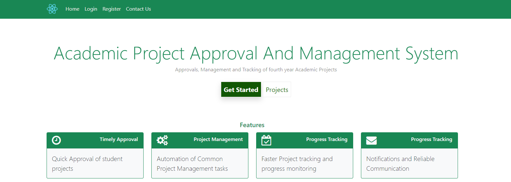

# Academic Project Approval & Management System

.\
Academic Project Approval and Management System is a web-based software application.\
The main purpose of this system is to automate all the project-management operations in academics and create an effective and efficient platform for students and their project supervisors and evaluators to manage their academic projects.

## Technologies
Front-end: ReactJs, HTML, CSS, JavaScript, Bootstrap.\
Back-end (`REST API`): Java, Spring Boot,Java Servlets and MySQL

## Project Features

The major features of the **Academic Project Approval and Management System** are:
1. Registration of Students, Supervisors, and Evaluation committee members
2. Project Creation and Approval
3. Project Planning and Scheduling
4. Reporting and Analysis: generating timely reports
5. Project Documentation and File sharing: uploading and sharing of project documents
6. Communication: information sharing through email
7. Time and Progress tracking

## Prerequisites

To use this project locally, the following software are required to be installed
1. NodeJs
2. Java
3. Tomcat Server and Apache Maven
4. MySQL server

## Credits
This project was created By [Wachiye Jeremiah Siranjofu](https://github.com/Wachiye). and contributed by [Rose Othiambo Atieno](https://github.com/Rose)